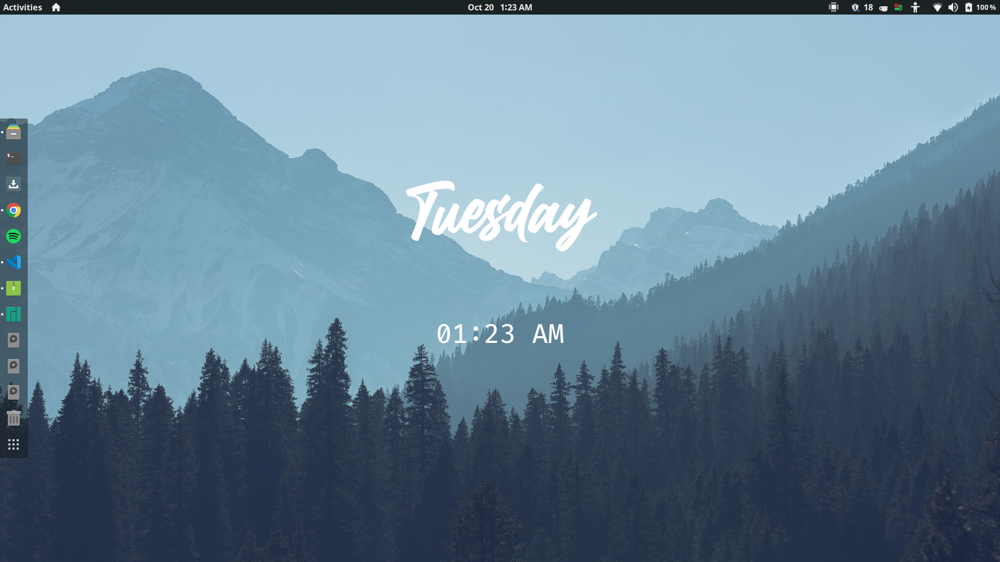

<a href="https://algorithm-visualizer.vercel.app/">

    
    

</a>

##   

`funkyD` is a desktop customization tool for Linux and Windows 

 

<!-- ## Features
funkyD can display Day and Time on Windows and Linux OS.

-  -->

## Screenshots

  
  

 

## Documentation
 TODO
